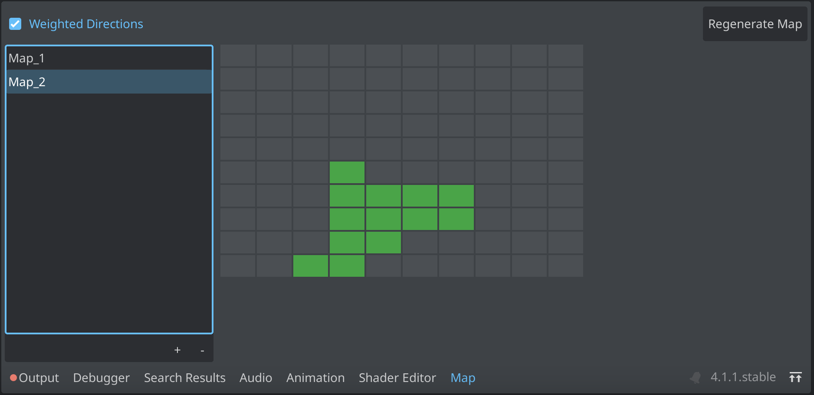
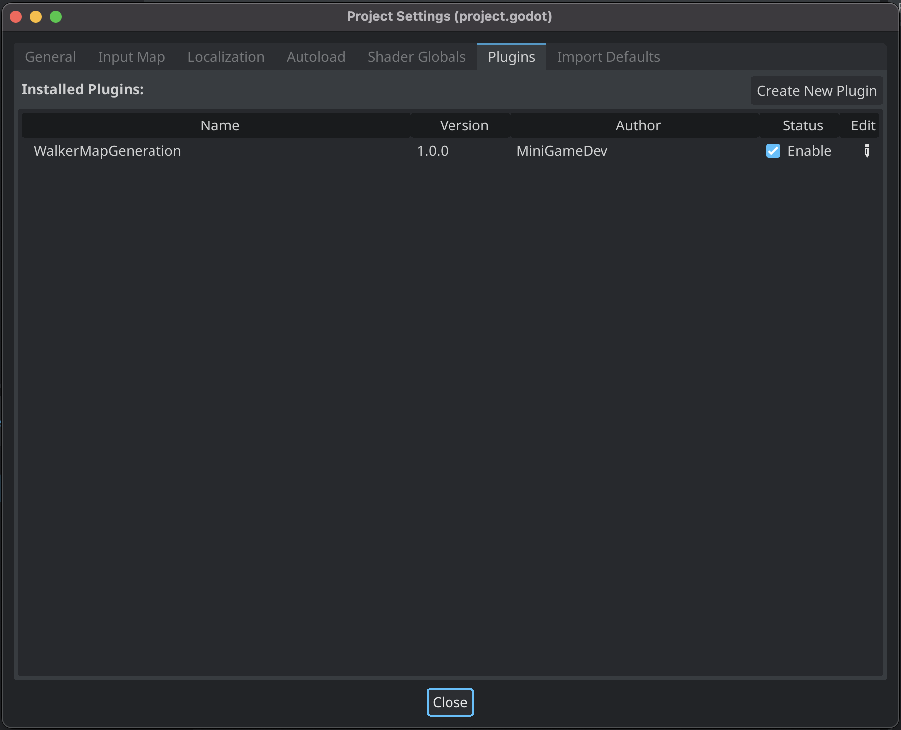
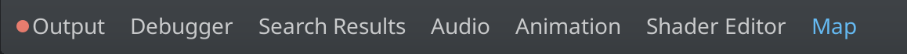

# WalkerMapGeneration

A plugin for Godot 4.x. WalkerMapGeneration uses the Random Walk or Drunken Walk Method, to generate a map structure for use in roguelike games or as a base for dungeons.

The plugin generates map data that can be used in 2D or 3D games. This was original developed for a roguelike, but can also be used to create static resources for dungeons levels. The plugin includes a visualization dock for map data. This can be used for debugging purposes or managing your dungeon levels.

## Installation

### Github

1. Download the repo
1. Copy the `addons/WalkerMapGeneration` directory to your project's `res://addons` directory.
1. Enable the plugin under Project Settings -> Plugins

4. The `Map` tab will display in in the bottom dock region.

## Usage

WalkerMapGeneration has two primary use cases. The first use case is to generate map data at runtime for use in roguelike games. The second use case is to create dungeon levels ahead of time (i.e. Legend of Zelda dungeons).

### Map

The `Map` object is a `Resource` that can be saved in the project or at runtime. There are two primary components to a Map. The first is the 2 dimensional rooms array. This represents all available rooms in the map. The second component is the connections array. A `Connection` represents the the bridge between two rooms.

### Map2D / Map3D Nodes

The `Map2DNode` and `Map3DNode` can be used at runtime to generate `Map` objects. Both of these nodes will emit the `map_generated` signal and pass the `Map` object down to all direct children with a `map` property defined.

#### Node Export Properties

1. **Map ID:** Identifier for map
1. **Map Area:** The total possible area that can be walked. Value is used as width and height
1. **Number of Steps:** The total number of steps the random walker will take
1. **Room Factory:** The `RoomFactory` resource is used to create the rooms.

### Room Factory

A `Resource` class meant to be overriden. The `RoomFactory` creates each room. Override this class if your rooms need more metadata for your game.

### Map Visualization

The Map dock is a debugging tool for `Map` objects. It displays the room layout for each selected `Map`. The `Regenerate Map` button is a **destructive operation** that will overwrite the room and connections data.

The `Weighted Directions` option prevents the random walk algorithm from backtracking through previously "walked" rooms. The idea behind this is to better utlize the given map area.

